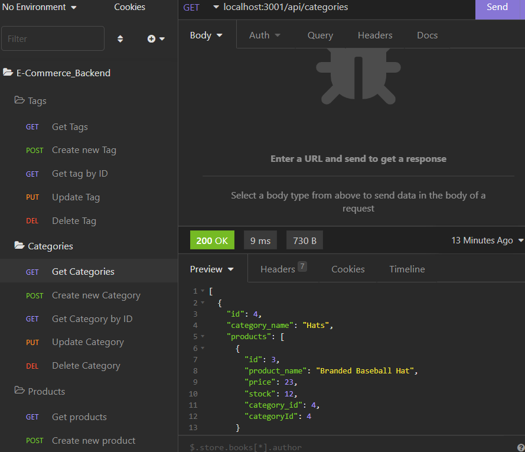

# E-Commerce-Back-End

## Description

This app builds the backend for an ecommerce website. The front end is not yet implemented. It contains a database schema, models for products, tags, categories and their relationships, seed data for each model, and routes to get, get by id, create, update, and delete data for each model. To start using this app, first run the schema in the mysql shell: 
```
DROP DATABASE IF EXISTS ecommerce_db;

CREATE DATABASE ecommerce_db;

USE ecommerce_db;
```
Next, make sure all the dependencies are installed by running npm i in the bash terminal: 

`npm i`

With everything installed, seed the database by running the seed command in the bash terminal:

 `npm run seed`

Finally, start the server from the terminal:

`npm start`.

With the server running, you can test all of these routes in the browser or using an app like Insomnia. 

## Walkthrough video:

https://drive.google.com/file/d/1NANSumlqmjgOguDcxiHDRMD1rnrVoHN5/view

## Screenshot:




## GitHub Repo:

https://github.com/james-stapleton/E-Commerce-Back-End